# Scrapyard TD

Pop cute eldritch critters before they hop the neon lanes and reach the Station Core.

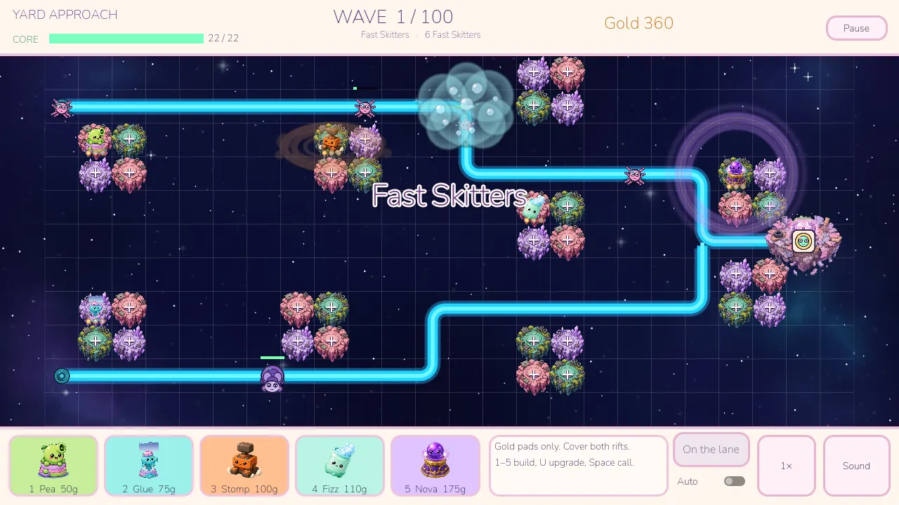

Desktop only, true top-down. **Battle** is the mode you can play. **Adventure** is a menu button that says it is coming soon.

## Download

**[v0.4.5](https://github.com/thegliffy/scrapyard-td/releases/tag/v0.4.5)** is the current build. You do not need Godot.

- Windows: [ScrapyardTD-v0.4.5-windows-x86_64.zip](https://github.com/thegliffy/scrapyard-td/releases/download/v0.4.5/ScrapyardTD-v0.4.5-windows-x86_64.zip). Unzip it and double-click `ScrapyardTD.exe`.
- Linux x86_64: [ScrapyardTD-v0.4.5-linux-x86_64.zip](https://github.com/thegliffy/scrapyard-td/releases/download/v0.4.5/ScrapyardTD-v0.4.5-linux-x86_64.zip). Unzip, then `chmod +x ScrapyardTD.x86_64` and `./ScrapyardTD.x86_64`.

**v0.4.5** — Side Dock and Deep Yard have their own lanes and islands.

Older builds stay up: [v0.4.4](https://github.com/thegliffy/scrapyard-td/releases/tag/v0.4.4), [v0.4.3](https://github.com/thegliffy/scrapyard-td/releases/tag/v0.4.3), [v0.4.2](https://github.com/thegliffy/scrapyard-td/releases/tag/v0.4.2), [v0.4.1](https://github.com/thegliffy/scrapyard-td/releases/tag/v0.4.1), [v0.4.0](https://github.com/thegliffy/scrapyard-td/releases/tag/v0.4.0).

## How to play

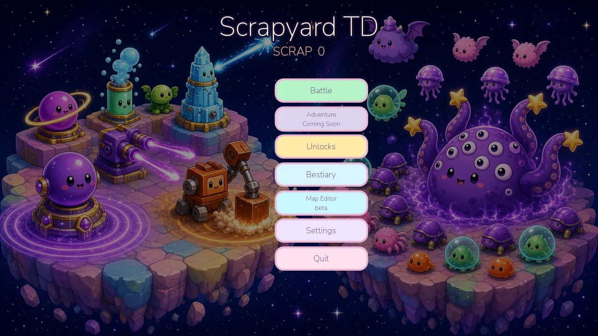

The menu opens on the splash. The title and buttons fade in over about a second, and the buttons stack in the dark gap between the two islands. Your saved **scrap** sits under the title.


Wave 1 does not count down and does not start by itself. Build as long as you like, then press **Start** (or `Space`). That first wave pays no early bonus.

You place guns on the floating islands. Slots come in **pods of four** (a 2×2). Each empty cell in a pod holds one tower. There is no free placement. Click a gold **+**, or press `1`–`5` and then click. You start with **Pea Blaster** and **Glue Goo** on the bar.

**Gold** pays for placing and upgrading. A Battle starts with **170 gold**, and gold resets when the run ends. Popping critters, the Scrap Magnet, and calling a later wave early all pay gold. Click a tower to see its range. Upgrade with `U` (three tiers) or sell with `Backspace` for 60% of the gold you spent, rounded down.

After wave 1, each prep lasts **9 seconds**. **Call** sends the next wave early and pays the seconds left as gold, so a fresh prep pays **9 gold** and waiting pays less. If you let the clock run out, the wave starts on its own. **Auto**, under Call, does that call for you from the second prep on. It never starts wave 1, and the choice is saved. `F` toggles **2×** speed.

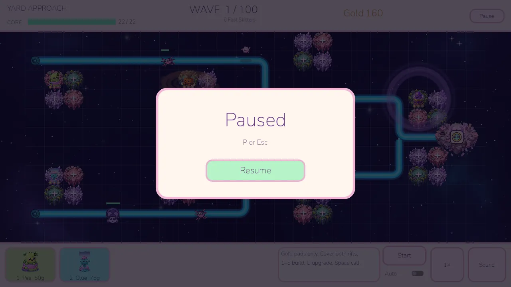

**Pause** (top right), `P`, or `Esc` freezes the battle. The overlay covers the board and the HUD, and clicks underneath do nothing. **Resume**, `P`, or `Esc` continues from the same moment, including 1× or 2×. Custom yards and editor playtests pause the same way.

**Scrap** is the other currency. It is not spent during a Battle. A win pays **2 scrap for each wave cleared** (200 if you finish all 100). A loss pays **1 scrap for each wave cleared**. The wave that puts the core out does not count. Scrap is saved on this machine (`user://profile.cfg`).

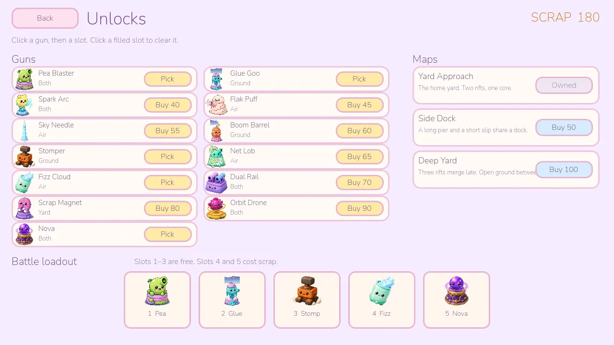

On **Unlocks**, click a gun you own, then a loadout slot. Click a filled slot to clear it. The loadout has **5 slots**. Slots **1–3 are free**. Slot **4 costs 30 scrap** and slot **5 costs 50 scrap**. Slot 5 cannot be bought before slot 4. The Battle bar shows only the guns in those slots.

Clear **100 waves** to win. The core has **22** health. If it hits 0, you lose. The end screen offers **Battle again** (`R`) or the main menu. A playtest's button says **Editor** instead.

## Guns

Every gun hits **Ground**, **Air**, or **Both**. Scrap Magnet does not shoot. Its label is **Yard**. Starters are already owned. The scrap column is the unlock price. Gold costs show on the Battle chips.

| | Gun | Hits | What it does | Scrap |
| --- | --- | --- | --- | --- |
|  | Pea Blaster | Both | Cheap and peppy. Hits ground and air. | Starter |
|  | Glue Goo | Ground | Slows ground critters. Tier 3 also slows the ones nearby. | Starter |
|  | Spark Arc | Both | Zaps a critter, then jumps to others it can reach. | 40 |
|  | Flak Puff | Air | A cheap puff. Splash hits air only. | 45 |
| 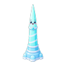 | Sky Needle | Air | A fast stitch. One flyer at a time. | 55 |
|  | Boom Barrel | Ground | Lobs a bomb. Splash hits the ground only. | 60 |
|  | Stomper | Ground | Slams the ground around itself. No shot. Ignores flyers. | 60 |
| 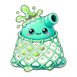 | Net Lob | Air | Slows flyers. Tier 3 also slows nearby ground critters. | 65 |
|  | Fizz Cloud | Air | Lobs a cloud that lingers and ticks every flyer inside. | 75 |
|  | Dual Rail | Both | Two little rails. Hits ground and air. | 70 |
|  | Scrap Magnet | Yard | No shooting. Pulls extra gold out of the yard. | 80 |
| 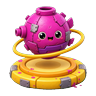 | Orbit Drone | Both | Slow and heavy, with a little splash on either layer. | 90 |
|  | Nova | Both | A slow pulse. Hits every critter in range, ground and air. | 110 |

Boom and Flak are projectile splash. Stomper, Fizz Cloud, and Nova are not: a slam, a lingering cloud, and a heavy pulse.

## Critters

They hop cell to cell along the lane. Flyers use that same path, drawn a little above the tiles. Unseen critters stay a dark silhouette in the Bestiary until you meet them in Battle.

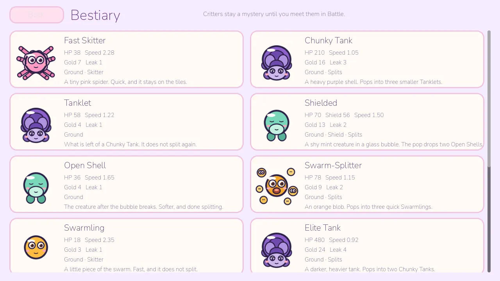

### Ground

| | Critter | Notes |
| --- | --- | --- |
|  | Fast Skitter | A tiny pink spider. Quick, and it stays on the tiles. |
|  | Chunky Tank | A heavy purple shell. Pops into three Tanklets. |
|  | Tanklet | What is left of a Chunky Tank. It does not split again. |
|  | Shielded | A mint creature in a bubble. The pop drops two Open Shells. |
|  | Open Shell | The creature after the bubble breaks. Done splitting. |
|  | Swarm-Splitter | An orange blob. Pops into three Swarmlings. |
|  | Swarmling | A little piece of the swarm. Fast, and it does not split. |
|  | Elite Tank | A darker, heavier tank. Pops into two Chunky Tanks. |

Tanklet and Elite Tank use the Chunky Tank drawing. Open Shell uses the Shielded drawing.

### Flyers

| | Critter | Notes |
| --- | --- | --- |
|  | Small Flyer | A tiny moth above the lane. First shows up on wave 14. |
|  | Flyer | A medium flyer. It follows the lane, up in the air. |
|  | Shielded Flyer | A flyer in a bubble. Pops into two Small Flyers. |

### Bosses

| | Critter | When | Notes |
| --- | --- | --- | --- |
|  | Big Cute Boss | Waves 21, 40, 60, 80, and 100 | The ground boss. Slow crawl. Burps Swarmlings. Later visits have more health. |
|  | Sky Nap | Waves 50 and 90 | The flying boss. Sheds Small Flyers as it drifts. |

Popping a splitter is not always safer than letting it walk. Swarmlings are faster than the blob, and a Chunky Tank leaves three Tanklets behind. The chain stops at the smallest tier.

## Battle

A run is **100 waves**. The first 21 are hand-built, including the first flight of Small Flyers on **wave 14**. After that, waves are generated: more critters, tighter gaps, flyers mixed in, and a health multiplier that keeps climbing.

Ground bosses are at **21, 40, 60, 80, and 100**. Sky Nap is at **50 and 90**.

Three yards, three layouts. Waves still say `a`, `b`, or `alt`. `a` is the first lane, `b` is the second (or the only lane, on a one-lane yard), and `alt` cycles every lane. On Deep Yard that third lane, Cut, takes every third alternating spawn. Bosses still walk the first lane.

| Yard | Scrap | Lanes | Difference |
| --- | --- | --- | --- |
| Yard Approach | Starter | 2 | North and south ribbons, nine pods, merge beside the core. Health and speed at their base. |
| Side Dock | 50 | 2 | Pier is a long S. Slip is a short spur that joins it. Eight pods on the bends and the shared dock. Cooler light. Critters have **1.1×** health. |
| Deep Yard | 100 | 3 | High and Low coil the long way. Cut is shorter and merges late. Seven pods, with open ground between them. Deeper dusk. Critters have **1.18×** health and **1.06×** speed. |

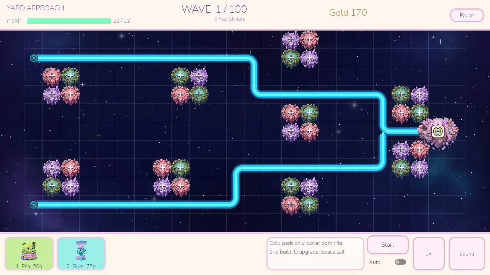

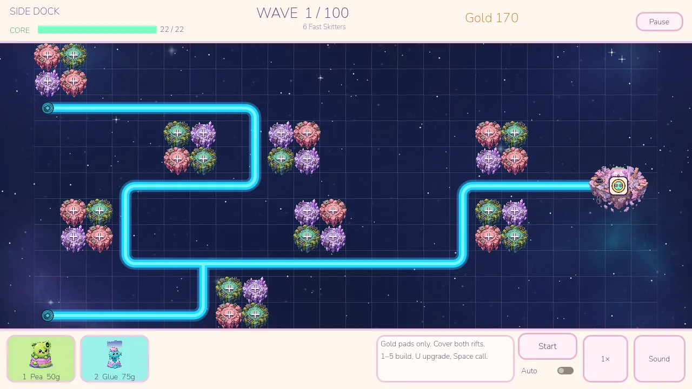

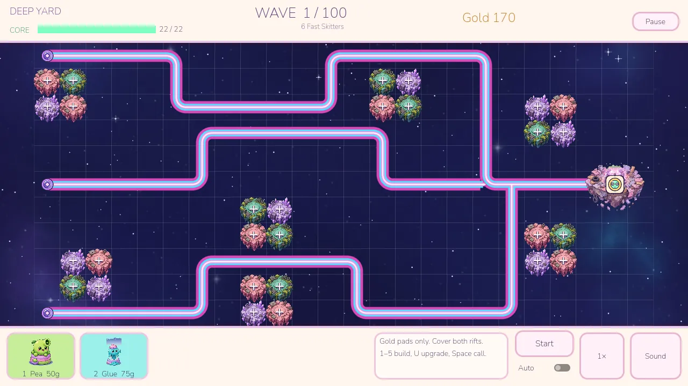

The picture at the top is a fight on Yard Approach: the deep-space plate, the smooth neon road, and the island pods.

## Map Editor

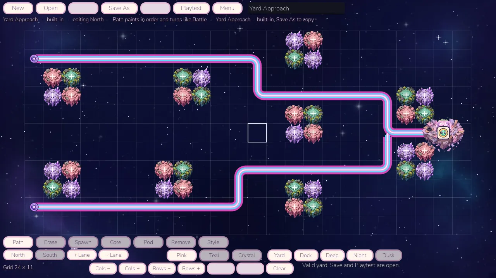

**Map Editor** on the menu is a beta yard tool. Paint and erase a lane (it stays orthogonal and draws as the same neon line as Battle), move that lane's spawn, set the Station Core, and place or remove a 2×2 hardpoint. Islands can be pink, teal, or crystal. The backdrop is **Night** (deep space) or **Dusk** (the older brighter field), with a Yard, Dock, or Deep tint. You can resize the grid, undo, redo, and clear. Up to four lanes.

Built-in yards live in `res://maps/`. Custom yards save to `user://maps/` on this machine. A built-in can be opened and saved as a copy. It cannot be overwritten or deleted. Save and Playtest stay off until every lane reaches the core, nothing sits on the path, and there is at least one hardpoint.

**Playtest** runs a Battle on the draft with Pea and Glue, then **Editor** on the end screen comes back. Playtests and custom yards award **no scrap**. Built-in yards still do. The saved profile is left alone either way.

The file format is written up in [docs/MAP_FORMAT.md](docs/MAP_FORMAT.md).

## Controls

| Key | Action |
| --- | --- |
| `1`–`5` | Pick that loadout slot |
| Click | Place the selected gun, or inspect a tower |
| `U` | Upgrade the selected tower |
| `Backspace` | Sell it for 60% of the gold spent |
| `Space` | Start wave 1, or Call the next wave |
| `F` | Toggle 1× / 2× |
| `P` or `Esc` | Pause or resume |
| `R` | Another Battle after a win or a loss |

## Building from source

The project is **Godot 4.7**. Open `project.godot` and press **F5**. The game starts on `scenes/main_menu.tscn`.

Export presets are in `export_presets.cfg`. Use the matching 4.7 export templates. Each export is one file with the game packed inside.

```bash
godot --headless --path . --export-release "Linux" export/linux/ScrapyardTD.x86_64
godot --headless --path . --export-release "Windows Desktop" export/windows/ScrapyardTD.exe
```

UI type is [Nunito](https://fonts.google.com/specimen/Nunito), SIL Open Font License (`assets/fonts/OFL-Nunito.txt`).

## Roadmap

**Adventure** is on the main menu and is not playable yet. The button says "Adventure is coming soon" and does not start a run. Yards are already JSON so a later mode can reuse the same maps. See [docs/MAP_FORMAT.md](docs/MAP_FORMAT.md).
